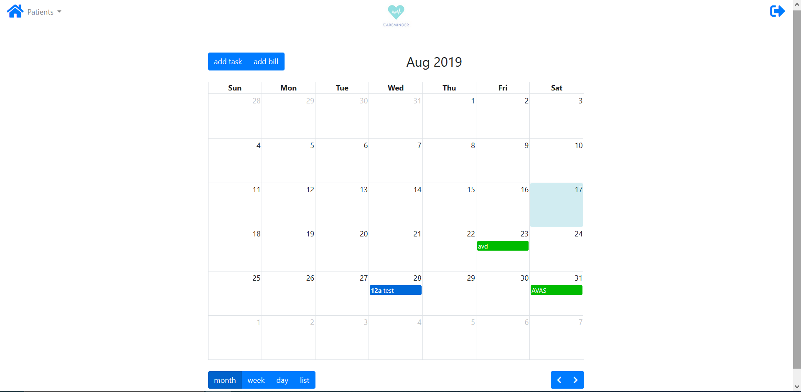
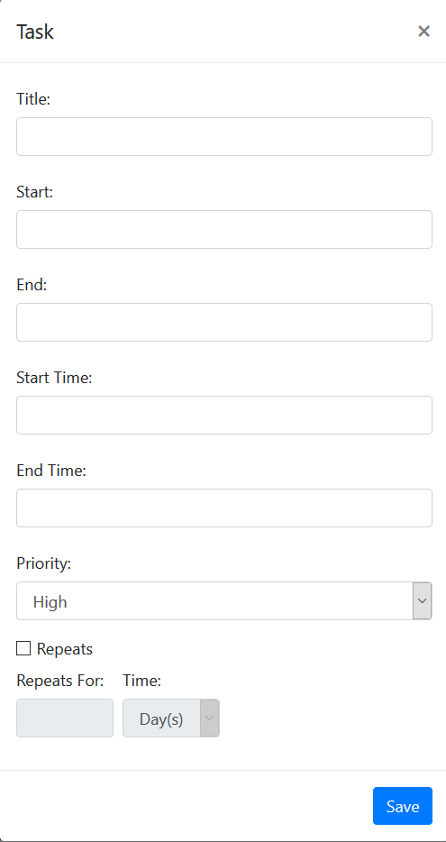
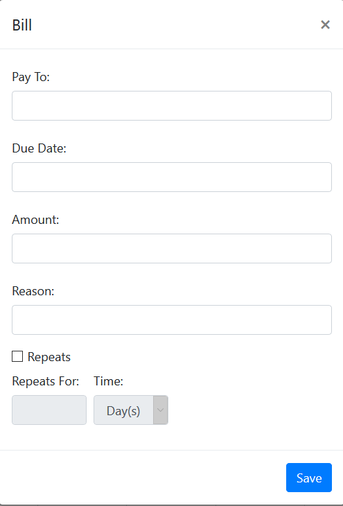
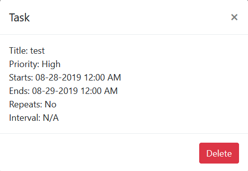
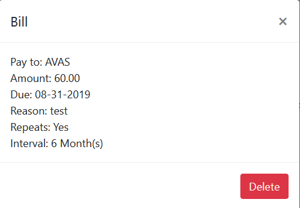

# CareMinder

[See the app here!](https://careminderbc.herokuapp.com)

CareMinder is an application that allows caregivers to create a schedule for the people that they are taking care of. The application uses a calendar library to display the information in an easy to see format. The caregiver can create patients and then assign tasks and bills to the patient to keep track of what the patient needs done or paid.

## Login

This is the login page, the caregiver can use this page to login to the application or go to the signup page to create an account.

## Signup

The caregiver can signup for the application through here, just by entering their information into the fields and clicking the Create Account button.

## Profile

Once signed in, the caregiver will arrive at the profile page above, where they can enter a patient they care taking care of. Once they have patients entered they can move on to the calendar page.

## Calendar

This is where tasks and bills can be added, the caregiver can click either add and a modal will show up:

Once the input hase been received, it will be sent to the server and added to the calendar, where the caregiver can click on it to show what they input for that event.

When they view the task or bill, they can choose to delete it, which will remove it from the calendar and the server.

